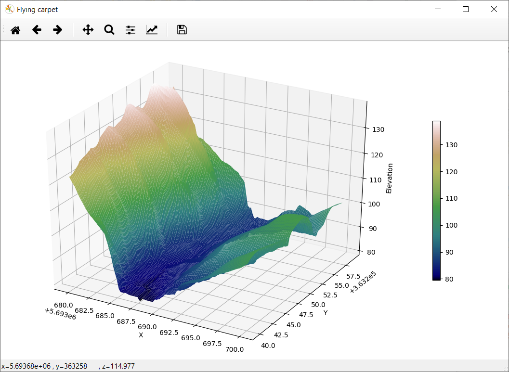
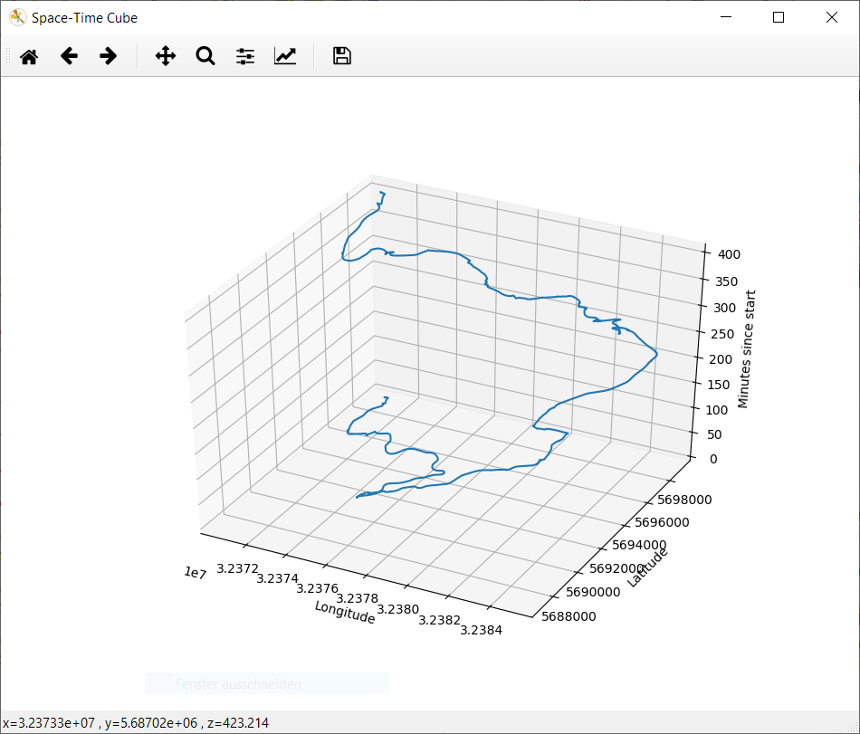

# 3d_visualization

Implementation 2.5D and 3D visualization of data with matplotlib.

## Requirements

A default installation of QGIS3 is required, with following libraries included:

 - osgeo and gdal
 - ogr
 - numpy
 - Matplotlib
 - datetime

## Installation and Usage

Download the 3d_visualization folder and load the content corresponding .py files in your QGIS environment, specifying paths to your raster and vector data.

## Available Features

- To visualize a Digital Elevation Model as a 2.5D map: run the *flying_carpet.py*

- To visualize a GPS track as a space-time cube: run the *spacetime_cube.py*

